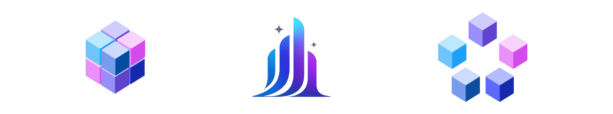
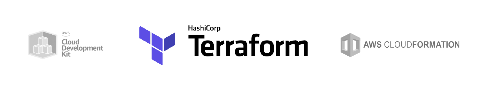

## Core Design Philosophy

Aurora was built around a fundamental principle: **make complex data infrastructure accessible without sacrificing production-grade capabilities**. This philosophy guided every major design decision, from technology choices to user interface design. The goal was to create a platform that could be operated by teams with minimal data engineering expertise while still providing the performance and reliability required for production workloads (Bass et al., 2021, p. 45).

## Technology Stack Decisions

### 1. ClickHouse as the Primary Database

**Decision**: Use ClickHouse instead of traditional databases like PostgreSQL or other columnar alternatives like Apache Druid or Amazon Redshift.

**Rationale**: ClickHouse delivers query performance that is 10-100x faster than traditional OLTP databases for analytical workloads. Its native support for real-time data insertion with sub-second latency makes it ideal for Aurora's streaming analytics use case. Built-in compression reduces storage costs by 5-10x, while its column-oriented storage is optimized for the aggregate queries typical in analytics (Abadi et al., 2013, p. 202; Stonebraker et al., 2005, p. 556). Compared to other columnar databases, ClickHouse offers superior performance for time-series data, simpler operational requirements than distributed systems like Druid, and significantly lower costs than managed solutions like Redshift.

**Trade-offs**: ClickHouse's SQL dialect differs from PostgreSQL, creating a learning curve for teams familiar with traditional databases. It requires specialized knowledge for performance tuning and lacks the mature ecosystem of tools available for established databases. The system is optimized for append-heavy workloads rather than frequent updates or deletes.

**Mitigation**: Aurora abstracts ClickHouse complexity through its natural language query interface while always displaying the generated SQL for learning. The platform provides standard SQL compatibility where possible and includes documentation for ClickHouse-specific optimizations.

### 2. Kafka as the Only Streaming Connection

**Decision**: Support only Kafka for data ingestion, rather than multiple streaming platforms like Pulsar, Kinesis, or direct database connections.

**Rationale**: Kafka is the de facto standard for enterprise event streaming, with widespread adoption ensuring compatibility with existing data infrastructure. Focusing on a single streaming platform allows Aurora to optimize deeply for Kafka's specific characteristics, including partition management, offset tracking, and SASL/SSL authentication. This focus enables better error handling, monitoring, and performance tuning compared to supporting multiple platforms.

**Trade-offs**: Teams using other streaming platforms cannot connect directly to Aurora without additional infrastructure. This limits initial adoption for organizations standardized on alternatives like Amazon Kinesis or Apache Pulsar.

**Mitigation**: Aurora's focused approach ensures excellent Kafka integration. Teams can use standard streaming platform bridges (like Kafka Connect) to integrate other data sources, maintaining Aurora's simplicity while supporting diverse data ecosystems.

### 3. Python for Backend Services

**Decision**: Use Python for all backend services instead of Go, Java, or Node.js.

**Rationale**: Python's rich ecosystem provides extensive libraries for data processing, machine learning, and LLM integration essential for Aurora's natural language features. The team's existing Python expertise reduces development time and maintenance complexity. Python's rapid prototyping capabilities enable faster iteration on AI-powered features, while libraries like FastAPI provide production-grade API performance.

**Trade-offs**: Python's interpreted nature results in slower execution compared to compiled languages and higher memory usage. Cold start times are longer, and deployment requires larger container images with complex dependency management.

**Mitigation**: Critical performance bottlenecks are optimized through efficient algorithms and caching. The modular architecture allows future migration of performance-critical components to faster languages if needed. Docker containerization standardizes deployment complexity across environments.

### 4. Next.js for Frontend

**Decision**: Use Next.js with TypeScript instead of vanilla React or alternative frameworks like Vue.js or Svelte.

**Rationale**: Next.js provides excellent developer experience with hot reloading, automatic code splitting, and built-in optimizations that accelerate development. TypeScript integration ensures code quality and maintainability for Aurora's complex data visualization interfaces. The framework's server-side rendering capabilities improve initial load performance, crucial for data-heavy applications.

**Trade-offs**: Next.js applications have larger initial bundles compared to vanilla React, potentially impacting load times. The framework enforces certain architectural constraints that reduce flexibility in some scenarios.

**Mitigation**: Aurora mitigates initial load time concerns by introducing a brief delay in deployment success confirmation, ensuring the application is fully loaded when users first access it. The architectural constraints are viewed positively as they enforce consistency and best practices across the codebase.

## Architecture Decisions

### 1. Modular Monolith vs. Microservices

**Decision**: Implement a hybrid modular monolith architecture with clear service boundaries.

**Rationale**: A modular monolith provides operational simplicity essential for teams with limited DevOps expertise--Aurora's target audience. Single deployments simplify testing, monitoring, and debugging compared to distributed systems. The approach is more resource-efficient, avoiding the overhead of service discovery, network communication, and distributed system complexity that can overwhelm smaller teams (Tanenbaum & van Steen, 2016, p. 78).

**Trade-offs**: All modules share the same deployment lifecycle, meaning updates to one component require redeploying the entire application. Technology choices are coupled across modules, and true independent scaling is limited since components cannot be scaled separately. The architecture requires careful internal API design to maintain modularity.

**Mitigation**: Aurora's modular design with well-defined interfaces enables future migration to microservices when scale demands it. AWS Application Load Balancer routing can direct traffic to different instances optimized for specific modules. The open-source nature allows teams to fork and modify individual components before deployment, reducing lock-in concerns.

### 2. Real-time Processing with ClickHouse Optimization

**Decision**: Support real-time data ingestion while optimizing for ClickHouse's batch-oriented columnar architecture.

**Rationale**: ClickHouse achieves optimal performance through batch operations due to its columnar storage format. This is a well-documented characteristic of columnar databases, where batch operations minimize the I/O overhead of writing to multiple columns (Ramakrishnan & Gehrke, 2003, p. 743). However, many use cases require low-latency data availability for operational dashboards and alerting. Aurora balances these needs by implementing configurable batch processing that groups real-time Kafka messages into ClickHouse's preferred insertion patterns while maintaining data freshness through adjustable batch sizes and time windows.

**Trade-offs**: Real-time ingestion requires careful buffer management and increases system complexity. ClickHouse's write performance is optimized for bulk operations, so individual record insertions are inefficient. Memory usage increases due to buffering requirements.

**Mitigation**: Aurora implements configurable batch sizes and time windows to balance latency and performance. MergeTree engine optimizations handle both real-time and historical data efficiently. Monitoring tracks buffer health and automatically adjusts batch parameters based on data volume patterns.

### 3. Schema Evolution Strategy

**Decision**: Prioritize performance through structured schemas while supporting controlled schema evolution.

**Rationale**: Structured schemas are a cornerstone of performant database systems, enabling effective query optimization and indexing (Silberschatz, Galvin, & Gagne, 2018, p. 571; Connolly & Begg, 2014, p. 422). Fast query response times are essential for Aurora's interactive natural language interface. Structured schemas also improve data quality and enable better AI-powered query generation through clear column types and descriptions.

**Trade-offs**: Schema changes require more planning and coordination compared to schemaless approaches. Rapid prototyping with evolving data structures becomes more complex. Migration procedures are needed when schema requirements change significantly.

**Mitigation**: Aurora supports creating new tables for major schema changes while maintaining historical data in original formats. The natural language interface helps abstract schema complexity from end users. Dynamic schema inference automatically detects structure from incoming Kafka messages.

## User Experience Decisions

### 1. Progressive Disclosure: Simplicity First, Power Available

**Decision**: Present a simple interface by default with advanced capabilities accessible through progressive disclosure.

**Rationale**: Most users benefit from simple interfaces that reduce cognitive load and training requirements. Business users can start deriving insights immediately without learning complex SQL syntax. However, power users still need access to advanced features for sophisticated analysis and optimization.

**Trade-offs**: Some advanced features may be harder to discover, potentially frustrating experienced users. The natural language interface might not expose all ClickHouse capabilities immediately. Balancing simplicity with completeness requires careful UX design decisions.

**Mitigation**: Aurora provides multiple interaction modes: natural language for simplicity, generated SQL visibility for learning, and raw SQL input for maximum control. Advanced features are logically grouped and accessible through clear navigation paths. Contextual help guides users toward appropriate tools for their skill level.

### 2. Natural Language vs. SQL Interface

**Decision**: Emphasize natural language queries while maintaining full SQL access and always showing generated queries.

**Rationale**: Natural language dramatically lowers the barrier to data access for business users who lack SQL expertise. Showing generated SQL serves dual purposes: building user confidence in query accuracy and providing learning opportunities. This approach democratizes data access while maintaining transparency and educational value.

**Trade-offs**: Natural language processing introduces latency and potential inaccuracies compared to direct SQL. LLM costs increase with usage, and complex analytical queries may be difficult to express in natural language. Users might become overly dependent on the AI interface.

**Mitigation**: Aurora always displays generated SQL for verification and learning. Users can edit generated queries before execution. The system includes query explanation features to help users understand complex generated SQL. Caching reduces LLM costs for repeated query patterns.

### 3. Integrated Visualization vs. External Tools

**Decision**: Integrate with Grafana rather than building custom visualization components.

**Rationale**: Grafana is the industry standard for operational dashboards and data visualization, providing mature features that would take years to replicate. Integration leverages existing user expertise and enables sophisticated visualization capabilities immediately. This approach allows Aurora to focus on its core strengths--data ingestion and natural language querying--rather than rebuilding visualization tools.

**Trade-offs**: Users must learn two interfaces: Aurora for data management and Grafana for visualization. The integration introduces additional complexity in deployment and authentication. Some visualization workflows require switching between applications.

**Mitigation**: Aurora provides seamless single sign-on integration with pre-configured Grafana instance. Clear documentation guides users through the integrated workflow. The modular architecture allows future replacement of Grafana with alternative visualization tools if needed.

## Operational Decisions

### 1. Infrastructure as Code with Terraform

**Decision**: Use Terraform for all infrastructure provisioning rather than manual setup or other IaC tools.

**Rationale**: Terraform provides cloud-agnostic infrastructure management with strong AWS provider support. Its declarative approach ensures reproducible deployments across environments, essential for Aurora's target users who may lack extensive DevOps experience. State management and plan previews reduce deployment risks compared to imperative scripts.

**Trade-offs**: Terraform requires additional learning for teams unfamiliar with infrastructure as code. State file management introduces complexity, and some AWS features may lag behind native CloudFormation support. Initial setup is more complex than manual provisioning.

**Mitigation**: Aurora provides complete Terraform configurations with clear documentation and sensible defaults. Automated state management using S3 backend reduces operational complexity. The modular structure allows teams to modify only necessary components without understanding the entire infrastructure.

### 2. Security-First Architecture

**Decision**: Implement comprehensive security measures from the foundation rather than adding them later.

**Rationale**: This 'security by design' approach is considered a best practice in software architecture, as retrofitting security is often more difficult and less effective (Bass et al., 2021, p. 113). Data platforms handle sensitive business information requiring strong security from day one. Compliance requirements often mandate specific security controls that are easier to implement during initial development. Building security in reduces future technical debt and potential vulnerabilities.

**Trade-offs**: Security measures increase initial setup complexity and may impact development velocity. Some security features can affect user experience through additional authentication steps. Comprehensive security requires ongoing maintenance and updates.

**Mitigation**: Aurora provides automated security configuration through Terraform with sensible defaults. Clear documentation explains security features and their business benefits. The system includes automated security validation to catch common misconfigurations.

### 3. Monitoring and Observability

**Decision**: Implement comprehensive logging and monitoring across all components with clear alerting thresholds.

**Rationale**: Data pipeline reliability is crucial for business operations, requiring proactive monitoring to prevent and quickly resolve issues. Aurora's target users may lack deep operational expertise, making clear monitoring and alerting essential for successful production deployments. Comprehensive logs enable effective troubleshooting when issues arise.

**Trade-offs**: Extensive monitoring increases system complexity and resource usage. Alert fatigue can occur if thresholds are not carefully tuned. Log storage costs can become significant at scale.

**Mitigation**: Aurora implements comprehensive logging across all components with configurable log levels. The system provides clear error messages and status indicators to help users identify issues quickly. Grafana integration enables custom monitoring dashboards as teams mature.

## Performance and Scale Decisions

### 1. Vertical vs. Horizontal Scaling

**Decision**: Optimize for vertical scaling with horizontal scaling available through configuration changes.

**Rationale**: Aurora's target users typically have workloads that benefit more from powerful individual instances than distributed complexity. Vertical scaling is operationally simpler, requiring only instance type changes rather than distributed system management. Most analytical workloads can be effectively served by modern large EC2 instances.

**Trade-offs**: Vertical scaling has upper limits and can create single points of failure. Costs may be higher than equivalent horizontal scaling for very large workloads. Scaling operations require brief downtime for instance type changes.

**Mitigation**: Aurora's architecture supports horizontal scaling through Terraform configuration changes when vertical limits are reached. The modular design enables selective scaling of specific components based on bottlenecks. Automated backup and recovery procedures minimize downtime during scaling operations.

### 2. Caching Strategy

**Decision**: Implement caching at multiple layers while maintaining data freshness guarantees.

**Rationale**: Caching is a fundamental technique for improving performance in data-intensive applications, especially for read-heavy and repetitive workloads (Kleppmann, 2017, p. 73). Aurora's natural language interface can generate similar SQL for related questions, making query result caching particularly effective. Schema embedding caching reduces LLM processing costs for repeated database introspection.

**Trade-offs**: Caching introduces complexity in cache invalidation and consistency management. Memory usage increases with cache size, and stale data could impact decision-making. Cache warming and eviction policies require careful tuning.

**Mitigation**: Aurora implements intelligent schema embedding that dramatically reduces LLM processing overhead by caching database structure information. The system automatically embeds schema elements for semantic search, enabling fast query generation without repeated database introspection. This approach provides significant performance benefits for natural language queries while maintaining data freshness and accuracy.

## Future Evolution Considerations

Aurora's design decisions prioritize current usability while maintaining flexibility for future growth. The modular architecture enables component-by-component scaling and technology evolution without requiring complete system rewrites (Taylor et al., 2009, p. 234). API-first design facilitates integration with emerging tools and platforms as they become available.

The open-source foundation allows community contributions and customization for specific use cases while maintaining the core platform's simplicity. As teams grow in data engineering maturity, they can gradually adopt more advanced features or migrate to more complex architectures using Aurora as a foundation.

These architectural decisions reflect Aurora's commitment to democratizing real-time data analytics while maintaining the performance, reliability, and security required for production use. The trade-offs prioritize user experience and operational simplicity, ensuring the platform remains accessible to teams with diverse technical backgrounds while providing a solid foundation for sophisticated data analysis workflows.
