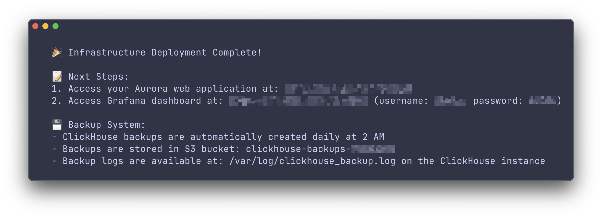

### 1. Install the Aurora CLI

Run the following command in your terminal:

```bash
npm install -g aurora-platform-cli
```

### 2. Deploy Aurora to AWS

1. Make sure you are authenticated with the AWS CLI:

   ```bash
   aws configure
   ```
2. At the start of deployment, you’ll be prompted to enter your OpenAI API key. If you don’t have one yet, [create a key](https://platform.openai.com/api-keys) following the [official instructions](https://platform.openai.com/docs/libraries#create-and-export-an-api-key).

   

3. Deploy Aurora:

   ```bash
   aurora deploy
   ```

### 3. Access Aurora

* After deployment, you’ll receive a link to your Aurora web app.


* From there, you can:
  * [Connect](https://auroraplatform.github.io/docs/connect/) to your Kafka topics
  * [Query](https://auroraplatform.github.io/docs/query/) data using natural language
  * [Visualize](https://auroraplatform.github.io/docs/visualize/) data with your integrated Grafana instance
