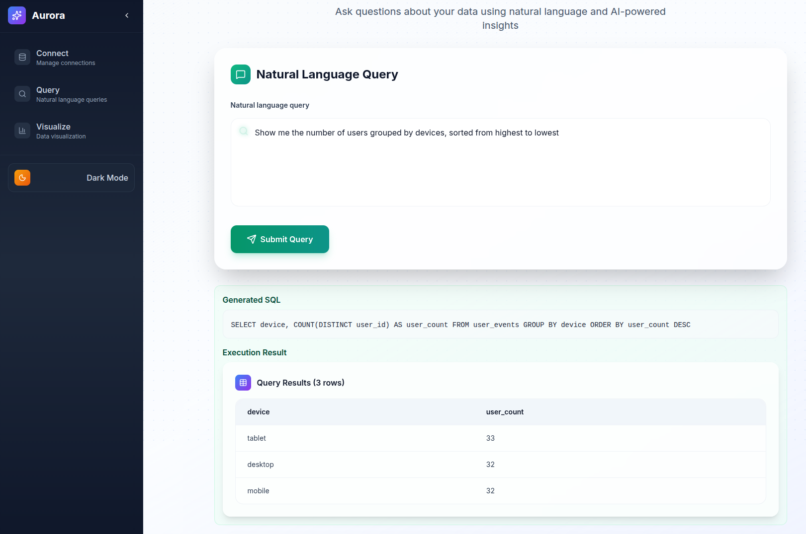

The **Query** page lets you explore data from your Aurora-connected Kafka streams using natural language. You don’t need SQL or knowledge of the database schema — just ask a question, and Aurora instantly generates the query and displays the results.

### Steps

1. **Access the Query Page**
   * Navigate to `/query` in your web browser, or click **Query** in the sidebar.
   * The natural language query interface will load.
2. **Enter a Question**
   * Type your question in the query box using natural language.
   * Example queries:
     * *"Show me the top 10 customers by revenue"*
     * *"How many orders were placed last week?"*
     * *"What are the most popular products this month?"*
3. **Submit Your Query**
   * Click **Submit** or press **Enter**.
   * Aurora analyzes your question and generates the corresponding SQL behind the scenes.
4. **View Results**
   * The generated SQL is displayed for transparency.
   * Query results appear in a table below the SQL.
5. **Refine Your Query**
   * If results aren’t what you expect, rephrase your question.
   * Add more context or specificity (e.g., time range, product category).

### Tips for Better Results

* Specify time ranges (e.g., *"last 30 days"*, *"this month"*).
* Mention table or column names if you know them.
* Use business terms that align with your data schema.
* Try alternate phrasings if the first attempt doesn’t give the expected results.

### Example Queries

* *"Show me user activity by hour for the last 24 hours"*
* *"What are the top 5 pages by page views?"*
* *"How many unique users visited our site today?"*
* *"Show me all orders with amount greater than \$100"*
