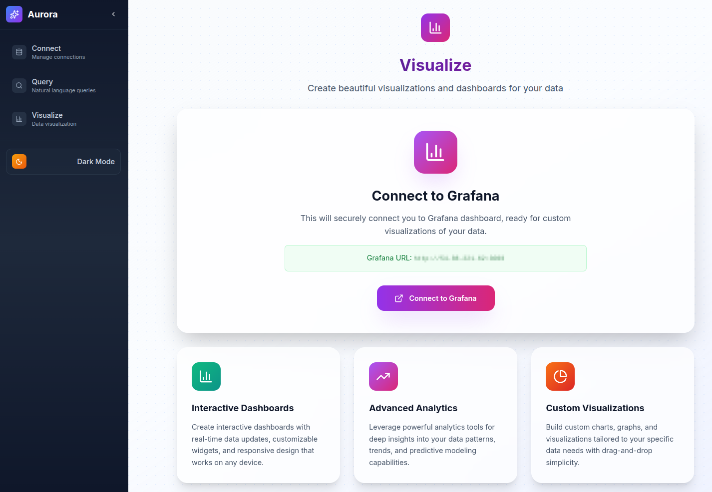

The **Visualize** page provides access to Grafana dashboards for advanced monitoring and analysis of your Kafka data streams. Aurora comes with a preconfigured Grafana instance, so you can start exploring your data with professional-grade visualizations immediately.

### Steps

1. **Access the Visualize Page**
   * Navigate to `/visualize` in your web browser, or click **Visualize** in the sidebar.
   * The page provides a link to your preconfigured Grafana instance.
2. **Open or Create a Dashboard**
   * Select an existing dashboard, organized by data type and use case.
   * Or create a new one by clicking **+ New Dashboard**.
3. **Customize Your View**
   * Adjust time ranges using the time picker.
   * Apply filters to narrow your data.
   * Switch between visualization types (tables, graphs, heatmaps, etc.).
4. **Add Custom Queries**
   * Click **Add Panel** to create a new visualization.
   * Use the query editor to write custom ClickHouse queries.
   * Choose from chart types such as line, bar, or pie.
5. **Save and Share**
   * Save dashboards with descriptive names.
   * Share dashboards via links or snapshots.
   * Export data or images as needed.

---

### Grafana Basics

* **Time Range**: Use the picker in the top-right corner.
* **Refresh**: Click the refresh button to update data.
* **Fullscreen**: Use the fullscreen icon or press **F11**.
* **Edit Panel**: Click any panel and select **Edit**.

### Quick Grafana Tips

* Use `$__timeFilter()` for automatic time filtering.
* Leverage ClickHouse functions like `uniq()`, `quantile()`, and `groupArray()`.
* Create template variables for dynamic filtering.
* Enable auto-refresh for real-time monitoring.

### Learn More

* [Grafana Documentation](https://grafana.com/docs/)
* [ClickHouse Data Source Guide](https://grafana.com/docs/grafana/latest/datasources/clickhouse/)
* [Dashboard Best Practices](https://grafana.com/docs/grafana/latest/best-practices/)

